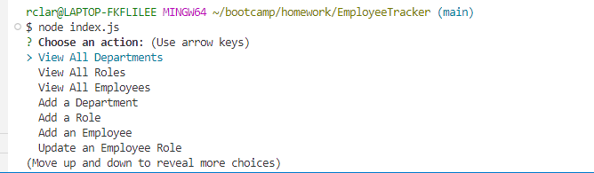

# EmployeeTracker

## Description 
This app was created with node.js, and allows users to input from inquirer to create an employee tracker database displaying associates of a company. PostgreSQL was also used to create data tables and schemas.

## Video Link
https://youtu.be/URI_crIFA-Y?si=kDxeMOHxqPY6IOWa 

## Screenshots 

